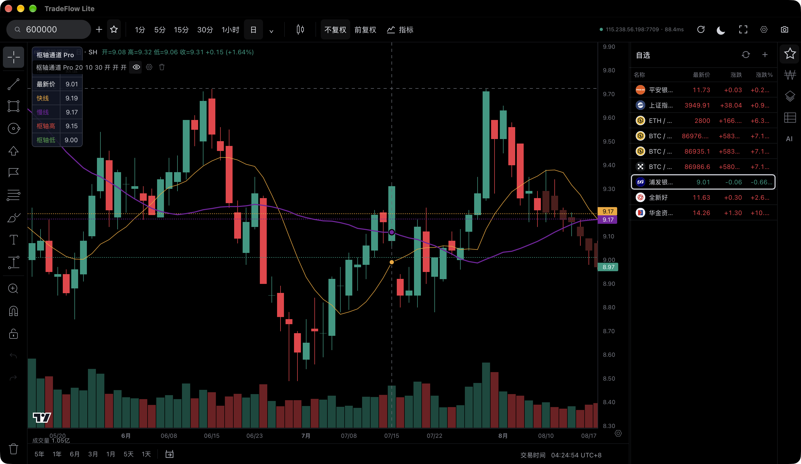
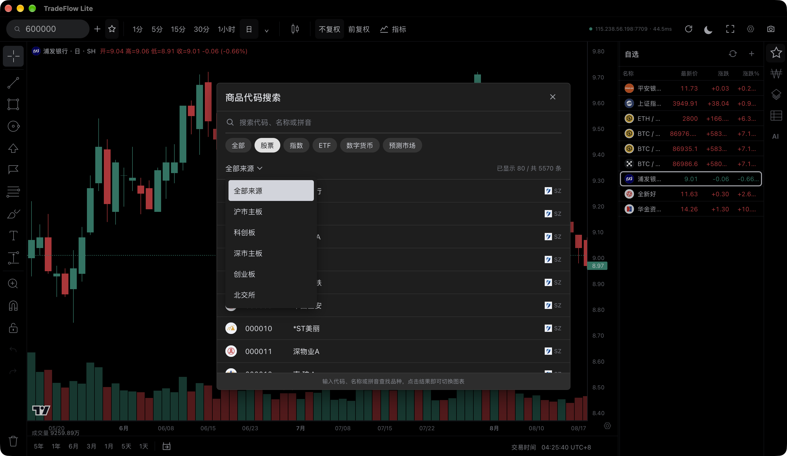
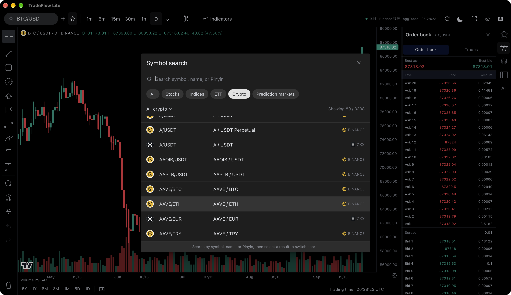
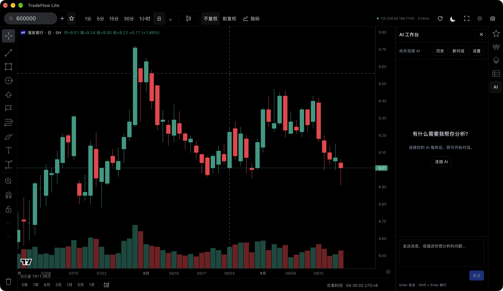

# TradeFlow Lite

**A desktop market-charting workspace with AI-generated indicators, local-data research and MCP tools.**

English · [简体中文](README.zh-CN.md)

TradeFlow Lite brings A-share, cryptocurrency and prediction-market charts into a local desktop workspace. Use the charts directly, or describe an idea to your AI: create an indicator, compare timeframes, annotate a chart, research your own data and save a report. Ordinary indicator and research workflows do not require editing the application source.

Built with **Tauri, Rust, TypeScript and TradingView Lightweight Charts**. TradeFlow Lite is an independent project, not TradingView Advanced Charts, a TradingView client or an affiliated TradingView product.

## Preview

### CN chart workspace



### Market discovery

| CN — A-share catalogue | Global — Binance and OKX markets |
| --- | --- |
|  |  |

### Optional AI workspace



## Start here

| What you need | Where to go |
| --- | --- |
| Run the app and open your first chart | [Getting started](docs/en/quick-start.md) |
| Charts, drawings, watchlists and indicators | [User guide](docs/en/user-guide.md) |
| Connect an AI API or an external MCP client | [AI and MCP guide](docs/en/ai-guide.md) |
| Ask AI to make an importable indicator | [Indicator reference](docs/en/indicators.md) |
| Use CSV, SQLite or Parquet for your research | [Local data and tasks](docs/en/data-and-tasks.md) |
| Try small, reproducible examples | [Examples](docs/en/examples.md) |
| Build and accept the two Windows editions locally | [Local Windows build and acceptance](docs/en/windows-local-build.md) |
| Give this repository to a coding assistant | [AGENTS.md](AGENTS.md) · [AI tool reference](docs/en/api-reference.md) |

## Editions

TradeFlow Lite uses one codebase and one adapter contract. Official builds differ in whether the TDX adapter is compiled into the application:

| Edition | Default market providers |
| --- | --- |
| **Global** | Binance Spot / USD-M, OKX Spot / Perpetual and Polymarket. **TDX is not compiled into this edition.** |
| **CN** | TDX A-shares plus the same Binance, OKX and Polymarket adapters. TDX is compiled in and enabled by default. |

The adapter and extension interfaces remain the same project. A compiled adapter can be enabled or disabled later in **Settings → Data sources**, but Global cannot enable TDX because its binary does not contain that crate. UI language does not change the edition.

**Distribution status:** this tree contains the application source. Check [GitHub Releases](https://github.com/hongchanho93/tradeflow-lite/releases) for any published installers and their platform-specific notes; do not treat GitHub's automatically generated source archives as installers. The base development configuration keeps bundling off; the two `tauri:build:*` scripts merge the release configuration that enables bundling. That build capability does not mean a signed installer has been published. See [Licensing](#licensing) for the source license and separate distribution boundaries.

## What it does

| Capability | What is included |
| --- | --- |
| Market charts | TDX A-share stocks, ETFs and indices; Binance spot and USD-M perpetual markets; OKX spot and swaps; Polymarket probability markets, subject to source and regional availability |
| Chart workspace | Multiple timeframes, provider-specific controls, watchlists, built-in indicators, drawing tools, markers and locally saved workspace settings |
| User indicators | Importable `.tfi` JavaScript indicators running in an isolated runtime: lines, panes, markers, candle styling, safe drawing commands and text panels |
| AI-assisted charting | Read data, calculate, navigate, annotate and manage indicators through the same application capabilities used by external MCP clients |
| User-owned data | Read-only `.tfc` connectors for explicitly selected local directories, including CSV, SQLite snapshots and supported Parquet files |
| Research tasks | `.tft` window-based calculations, tables, symbol lists, series and reports; reusable task definitions and new Markdown, TXT, CSV or JSON result files |

Provider support is not a promise of complete history, uninterrupted access or redistribution rights. Check each result's source, time range, coverage and finality. An empty or unavailable result is not a trading signal.

## Tell AI what you need

> Keep my daily chart unchanged and show a 16-period monthly moving average.

> Create an indicator that marks the conditions I describe. Explain when the marks can change before the bar closes.

> Read the data directory I selected, test this calculation on a small sample, and save the resulting table to Downloads.

Use the **AI** button in the right sidebar. Provider settings, API credentials, **My Data** and **external AI / MCP** are together in **AI → Settings**. Research tasks run through the conversation; there is no separate task page to learn in the normal workflow.

AI is optional for ordinary charting. Model requests use the service you configure and may incur that service's charges. Data or indicator source read during an AI task may be sent to that service. See [data access and permissions](docs/en/ai-guide.md).

## Boundaries

TradeFlow Lite does **not** provide brokerage accounts, order execution, investment recommendations, a hosted full-market database, a Pine Script engine or a complete historical backtesting/execution simulator. Prediction-market probability series are not OHLCV candles. The application does not require an indicator marketplace or maintainer approval to use your own compatible `.tfi` files.

The built-in assistant and business MCP interface cannot edit the application's source, run shell commands or access arbitrary files. A separately authorized coding assistant can work on your own checkout; that is a different workflow described in [Source extensions](docs/en/extensions.md).

## Run from source

Install the prerequisites in [Getting started](docs/en/quick-start.md), then:

```sh
git clone https://github.com/hongchanho93/tradeflow-lite.git
cd tradeflow-lite
npm ci
npm run tauri:dev:global
```

Use `npm run tauri:dev:cn` for the CN edition. A plain `npm run tauri dev` has no TDX feature and therefore uses the Global boundary; use the named scripts for reproducible edition builds. Repository access is required while the repository is private. `npm run dev` alone starts only the web frontend, not the native market-data and local-file services. No Python runtime is required for the bundled market adapters.

## Help and project information

[Frequently asked questions](docs/en/faq.md) · [Report an issue](https://github.com/hongchanho93/tradeflow-lite/issues) · [Machine-readable documentation index](llms.txt)

TradeFlow Lite is the independently extensible project in the TradeFlow family. The related project website is [tradeflow.cn](https://tradeflow.cn/). This repository documents Lite; features of other TradeFlow products are not implied here.

## Licensing

Original TradeFlow Lite source files are licensed under [MPL-2.0](LICENSE), unless a file or directory states a different license. The independent [`tradeflow-tdx`](https://github.com/hongchanho93/tradeflow-tdx) crate is separately licensed under `MIT OR Apache-2.0`. Third-party components retain their own licenses and notices; see the [third-party inventory](THIRD_PARTY_LICENSES.md).

The software licenses do not grant rights to the TradeFlow / 图迹 names, logos or app icons; see the [trademark policy](TRADEMARKS.md). They also do not grant access to, or redistribution rights in, market-data services or third-party data. External contributions require the process in [CONTRIBUTING.md](CONTRIBUTING.md) and the [CLA](CLA.md). The third-party inventory remains a distribution-audit record; licensing the source does not by itself prove that a signed installer is ready to publish.
